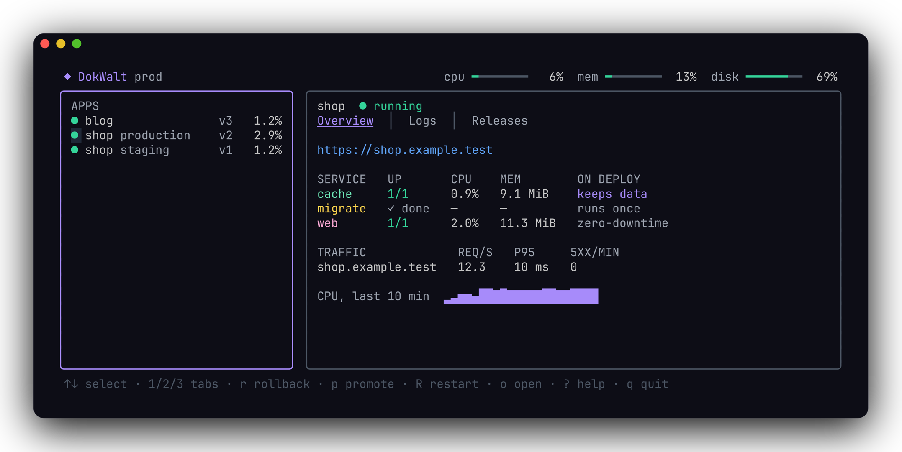
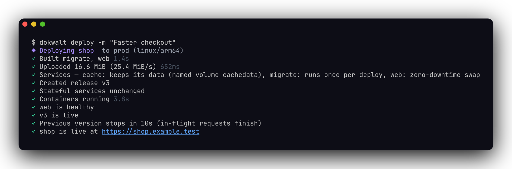
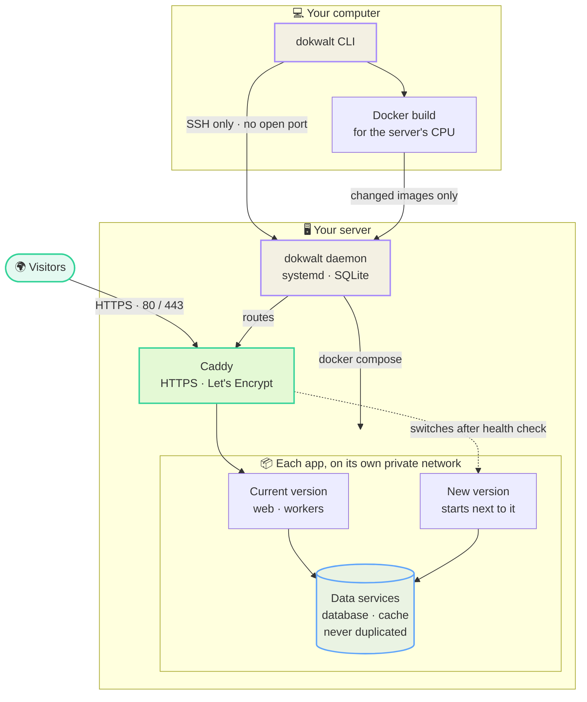

# DokWalt

**Deploy Docker Compose apps to your own server — Heroku's workflow, none of the bloat.**

[](https://github.com/ddahan/dokwalt/releases/latest)
[](LICENSE)


DokWalt is a single small binary. On your laptop it's a polished CLI (plus a live
full-screen dashboard); on your server it's a ~27 MB daemon next to the Caddy
proxy. Your `docker-compose.yml` stays exactly as it is.

<p align="center">
  
</p>

<p align="center">
  
</p>

## ✨ Features

🚀 **Zero-downtime deploys** — the new version starts next to the old one and must
pass its health checks before traffic switches. If it fails, the current version
keeps serving and you see your app's own error logs.

🔌 **Survives reboots and power cuts** — a self-healing daemon brings every site back
on its own. Tested: sites answer again within seconds after pulling the plug.

⏪ **Releases & instant rollbacks** — every deploy and config change is a numbered
release. `dokwalt rollback` is instant: the images are already on the server.

🔀 **Optional pipelines** — add a staging stage when a project deserves it, then
`dokwalt promote` ships staging's *exact* images to production. No rebuild, no upload.

🐳 **Native Docker Compose** — databases and caches are never duplicated and only
restart when their own definition changes. One-shot jobs run your migrations
before the new version starts.

🗄️ **Shared databases & backups** — run one Postgres for all your apps with
`x-dokwalt: {uses: [postgres]}`, still isolated from each other. Every night, each
database and DokWalt's own state go to Cloudflare R2 (or any S3 storage), with
daily and weekly retention and one-command restores.

🔒 **Automatic HTTPS** — Let's Encrypt certificates via Caddy, redirects, and a real
check that your DNS and ports are right.

🔑 **12-factor config** — config vars live on the server, encrypted, never in your
repo. Changing one rolls out a new release with zero downtime.

📊 **Logs & monitoring** — merged live logs, `top`, 7-day metrics, request rates,
latency and errors per domain.

🔔 **Discord & Slack alerts** — get a message when a site goes down, a deploy fails,
a container crash-loops, a certificate can't be issued, or the disk, memory or CPU
temperature crosses your threshold — and another one when it's resolved.

🖥️ **Gorgeous CLI & dashboard** — live progress, colors, and a full-screen dashboard
(just type `dokwalt`). Built-in docs with `dokwalt docs`.

🪶 **Small & private** — no web UI, no Swarm/Kubernetes, no Redis. SQLite for state,
~27 MB of RAM. Nothing exposed: you talk to the server over SSH, and only the proxy
listens on 80/443.

🍓 **Raspberry Pi ready** — a complete Pi 5 guide ships with the tool
(`dokwalt docs raspberry-pi`).

## 📋 Requirements

| | |
|---|---|
| **Your computer** | macOS (Apple Silicon or Intel) or Linux, with **Docker** (Docker Desktop or OrbStack): images are built here |
| **Server** | Debian 12+, Ubuntu 22.04+ or Raspberry Pi OS — **64-bit** (amd64 or arm64), with systemd. 1 GB RAM is enough for a few small sites |
| **Access** | SSH login **with a key** (`ssh you@server` works without a password) and `sudo` rights. Docker is installed for you if missing |
| **Network** | Ports **80** and **443** reachable from the internet, and a DNS record (A/AAAA) for each domain pointing to the server |

## 📦 Install

**1. Install the CLI** on your computer (macOS or Linux; on Windows, inside [WSL](https://learn.microsoft.com/windows/wsl/install)):

```bash
curl -fsSL https://raw.githubusercontent.com/ddahan/dokwalt/main/install.sh | sh
```

The script picks the right binary for your system, verifies its checksum,
installs it where your shell will find it, and tells you if anything is missing
(like Docker). Run the same command again later to upgrade. Prefer to read it
first? [`install.sh`](install.sh) is short.

**2. Install DokWalt on your server** (you'll be asked for your sudo password there):

```bash
dokwalt server init you@your-server --email you@example.com
```

This downloads the matching Linux binary from the release (checksum verified),
installs Docker if needed, sets up the `dokwalt` systemd service and the Caddy
proxy, and saves the server on your machine. The email is for Let's Encrypt
expiry notices.

## 🚀 Your first deploy

In the folder of a project that has a `compose.yaml` / `docker-compose.yml`:

```bash
dokwalt apps:create myapp                   # creates the app and links this folder
dokwalt config:set SECRET_KEY=change-me     # config lives on the server
dokwalt deploy                              # build here, upload, roll out
dokwalt domains:add myapp.example.com --service web
```

Open `https://myapp.example.com` — the certificate is issued automatically once
DNS points to your server. Then type `dokwalt` for the live dashboard.

**Tips for your compose file**

- Declare the port your web service listens on (`ports:` or `expose:`) — DokWalt
  routes the domain there. Published ports are ignored: only the proxy is public.
- Reference config with `${VAR}` (e.g. `POSTGRES_PASSWORD: ${DB_PASSWORD}`) and set
  it with `dokwalt config:set`. Stateless services also receive every config var.
- Migrations: add a service that runs them and make your web service
  `depends_on` it with `condition: service_completed_successfully`.
- More in `dokwalt docs compose` and `dokwalt docs getting-started`.

## 🧰 Everyday commands

| Command | What it does |
|---|---|
| `dokwalt deploy` | build for the server's CPU, upload changed images, roll out |
| `dokwalt releases` · `rollback [vN]` | history and instant rollback |
| `dokwalt config:set K=V` | set config vars (encrypted; zero-downtime restart) |
| `dokwalt domains:add` · `domains:redirect` | routing with automatic HTTPS |
| `dokwalt logs -f` | merged, colored, live logs of every service |
| `dokwalt top` · `metrics` | live CPU / RAM / network / traffic, and 7-day history |
| `dokwalt db:connect` | psql / mysql / mongosh / redis-cli over SSH, or a tunnel for a GUI |
| `dokwalt exec -- sh` | a shell in a running container |
| `dokwalt pipeline:enable` · `promote` | staging → production with the same images |
| `dokwalt alerts:add discord <url>` | alerts: site down, crash loop, disk, temperature… |
| `dokwalt doctor` | diagnose the server, the apps, DNS and your machine |
| `dokwalt docs [topic]` | the full documentation, in your terminal |

Every command has examples in `dokwalt <command> --help`.

## ⬆️ Upgrading

Run the install command again, then:

```bash
dokwalt server upgrade    # your apps keep running during the upgrade
```

## ⚙️ How it works



- 🏗️ Builds happen on your machine for the server's CPU (amd64 or arm64). Images
  are content-addressed, so unchanged images are never uploaded twice.
- 🧩 The daemon splits your compose project in two: services that **keep data**
  (databases, caches, anything with a named volume) keep running and are never
  duplicated, while **everything else is swapped**: two copies (internally
  called blue and green) take turns, so the new version starts next to the old
  one and replaces it with zero downtime.
- 🔐 Config values only live in the daemon's encrypted store and in the
  environment of the `docker compose` process — never in files, never in git.
- 🛡️ Caddy is the only public listener, and each app gets its own private network.
  Caddy's config is written to disk too, so after a reboot it serves the
  last-known-good routes even before the daemon starts.

Full design: [`docs/SPEC.md`](docs/SPEC.md) · `dokwalt docs concepts`.

## 🗑️ Uninstall

On your computer: `sudo rm /usr/local/bin/dokwalt ~/.config/dokwalt/config.json`.

On the server, destroy each app first (`dokwalt apps:destroy <name>` removes its
containers, volumes and data), then:

```bash
sudo systemctl disable --now dokwalt
docker compose -p dokwalt-system down -v    # the Caddy proxy and its certificates
sudo rm -rf /usr/local/bin/dokwalt /etc/systemd/system/dokwalt.service /var/lib/dokwalt
```

## 🛠️ Development

Building from source needs Go 1.27+ and Docker.

```bash
git clone https://github.com/ddahan/dokwalt && cd dokwalt
make build   # bin/dokwalt + linux server binaries (used by `server init`)
make test    # unit tests
make e2e     # full end-to-end run against a throwaway systemd + Docker server container
make dist    # release binaries + checksums
```

The e2e suite installs DokWalt on a privileged Debian container and checks deploys
under load (0 failed requests), config releases, rollback, pipelines, failed
deploys, the DB tunnel, reboot and power-cut recovery, and the daemon's memory budget.

---

MIT licensed · no telemetry.
